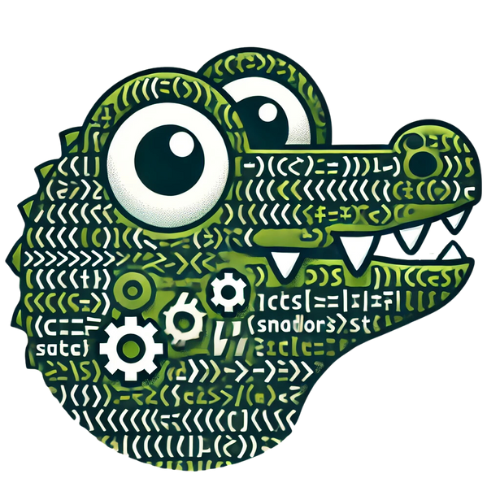

<a href="https://github.com/santiagosauma/CoCody-Compiler">
  
</a>
<a id="readme-top"></a>
<h1 align="center">CoCody Compiler</h3>
<div align="center">
  <a href="https://github.com/santiagosauma/CoCody-Compiler">
    
  </a>

  <p align="center">
    A simple programming language designed to teach the basics of programming in the Hispanic Community.
    <br />
    <a href="https://github.com/santiagosauma/CoCody-Compiler/blob/main/Documentación%20-%20CoCody.md"><strong>Explore the docs »</strong></a>
    <br />
    <br />
    <a href="https://drive.google.com/file/d/16wHxqWJuvmv1FTUoZW-Pv9A0kq1BxEzb/view?usp=sharing">View Demo</a>
    ·
    <a href="https://github.com/santiagosauma/CoCody-Compiler/issues/new">Report Bug</a>
    ·
    <a href="https://github.com/santiagosauma/CoCody-Compiler/issues/new">Request Feature</a>
  </p>
</div>


<!-- TABLE OF CONTENTS -->
<details>
  <summary>Table of Contents</summary>
  <ol>
    <li>
      <a href="#about-the-project">About The Project</a>
      <ul>
        <li><a href="#built-with">Built With</a></li>
      </ul>
    </li>
    <li>
      <a href="#getting-started">Getting Started</a>
      <ul>
        <li><a href="#prerequisites">Prerequisites</a></li>
        <li><a href="#installation">Installation</a></li>
      </ul>
    </li>
    <li><a href="#usage">Usage</a></li>
    <li><a href="#roadmap">Roadmap</a></li>
    <li><a href="#contributing">Contributing</a></li>
    <li><a href="#license">License</a></li>
    <li><a href="#contact">Contact</a></li>
    <li><a href="#acknowledgments">Acknowledgments</a></li>
  </ol>
</details>


<!-- ABOUT THE PROJECT -->
## About The Project


CoCody is an educational programming language built to make learning programming accessible for beginners. 🧑‍💻 It was developed during the **1st Hackathon by Código Facilito** and is named in honor of Cody, Código Facilito's mascot. The language aims to introduce core programming concepts in an intuitive and beginner-friendly manner.

### Key Highlights 🌟
- **Simple & Intuitive Syntax** ✍️: Designed for beginners, CoCody's syntax makes it easy to learn programming basics.
- **Comprehensive Feature Support** 📋: Includes support for variables, arithmetic operators, conditional structures (`si...ENTONCES`), and loops (`mientras...HACER`).
- **Algorithm Efficiency** ⚙️: Efficiently handles classic algorithms such as **BubbleSort**, **QuickSort**, and **Linear Search**.
- **Cross-Language Translation** 🌐: Integrates with the Gemini AI to translate programs into other programming languages, broadening accessibility.
- **Code Documentation Generation** 📝: Uses AI to automatically document code, making it easy to understand and share.
- **Debugging Visualizer** 📊: Includes a debugging visualizer that generates graphical representations of algorithms, helping users understand complex logic visually.

With CoCody, new programmers can learn fundamentals like working with variables, using arithmetic and logical operators, and implementing control structures, all within a fun and interactive environment.

For more details, we encourage you to explore the complete documentation. 📚

### Built With 🛠️

* [![Anaconda][Anaconda.com]][Anaconda-url]
* [![Python][Python.org]][Python-url]
* [![rply][rply.dev]][rply-url]
* [![LLVM][LLVM.org]][LLVM-url]
* [![Gemini AI][Gemini.dev]][Gemini-url]
* [![Bash][Bash.dev]][Bash-url]

## Getting Started 🚀

To set up CoCody on your local machine, follow these steps. We recommend using Anaconda to manage dependencies and virtual environments for an isolated setup.

### Prerequisites 📋

1. **Install [Anaconda](https://www.anaconda.com/products/distribution)**: Download and install Anaconda for your operating system.
2. **Python 3.8 or higher**: Anaconda includes Python, so make sure you install a version that includes Python 3.8 or above.

### Installation 🔧

1. **Clone the Repository**:
   ```sh
   git clone https://github.com/santiagosauma/CoCody-Compiler
   cd CoCody-Compiler
   ```

2. **Install LLVM**:
   - Download LLVM from the following repository.
   - For Windows, download `clang+llvm-18.1.8-x86_64-pc-windows-msvc.tar.xz` from:
   
   ```sh
   https://github.com/llvm/llvm-project/releases/tag/llvmorg-18.1.8
   ```

3. **Add LLVM to System PATH**:
   - After extracting LLVM, add its `bin` folder to the system PATH.
   - Example path: `C:\Program Files\LLVM\bin`

4. **Create a Virtual Environment**:
   Open a terminal or Anaconda Prompt, navigate to the CoCody project folder, and create a virtual environment (e.g., `cocody_env`):
   
   ```sh
   conda create -n cocody_env python=3.8
   ```

5. **Activate the Virtual Environment**:
   After creating the environment, activate it:
   
   ```sh
   conda activate cocody_env
   ```

6. **Install Required Packages**:
   With the virtual environment activated, install the dependencies from `requirements.txt`:
   
   ```sh
   pip install -r requirements.txt
   ```

7. **Set Up Environment Variables** (Needed for certain functions):
   CoCody might require certain API keys or settings in a `.env` file. Follow these steps to get your Gemini API Key and add it to the `.env` file:

   - Go to the [Gemini AI website](https://ai.google.dev/gemini-api/docs/api-key) and sign in to your account.
   - Navigate to the **API** section in your account settings.
   - Generate a new API Key and copy it.
   - In the root of your CoCody project, create a file named `.env`.
   - Open the `.env` file and add the following line, replacing `YOUR_GEMINI_API_KEY` with your actual API key:
     
     ```sh
     API_KEY=YOUR_GEMINI_API_KEY
     ```

   After adding this line, CoCody will be able to access Gemini's API for functionalities like code documentation, translation, and visualization.

8. **Run CoCody**:
   Once everything is set up, you’re ready to start using CoCody!

For more guidance on writing a compiler with Python, you can explore resources like [this Medium article](https://medium.com/@marcelogdeandrade/writing-your-own-programming-language-and-compiler-with-python-a468970ae6df) which was instrumental in the creation of CoCody.

## Usage

With CoCody, you can write programs using basic syntax to perform arithmetic operations, define variables, and use control structures like conditionals and loops. For example, a simple CoCody program might look like this:

```cocody
x <- 10
muestra(x)
si (x > 5) ENTONCES
    muestra("x is greater than 5")
FIN_SI
```

To get a better understanding of how to write CoCody code, you can refer to:
- [Example Cases](https://github.com/santiagosauma/CoCody-Compiler/tree/main/Casos): Explore examples of CoCody programs.
- [Documentation](https://github.com/santiagosauma/CoCody-Compiler/blob/main/Documentación%20-%20CoCody.md): Learn more about CoCody’s syntax, supported operations, and features.

### Running a CoCody Program

Once you have set up the environment and written your CoCody code in a file (e.g., `my_program.cody`), you can execute it by running the following command in your terminal:

```sh
.\run_cody.bat <filename.cody>
```

Replace `<filename.cody>` with the actual file name of your CoCody program. This command will interpret and run the program in the CoCody environment.

## Roadmap

<details>
  <summary>Core Functionalities</summary>

- [x] **Arithmetic and Variable Handling**: Implement support for basic arithmetic operations (addition, subtraction, multiplication, division) and variable assignments.
- [x] **Conditional Statements**: Add support for conditional statements like `IF` and logical operations.
- [x] **Loops**: Implement loops such as `FOR` and `WHILE` to allow repetitive tasks within the CoCody language.
- [x] **Functionality for Lists**: Introduce support for lists, list indexing, and list manipulation.
- [x] **Error Handling**: Add error handling to manage lexical and syntax errors.

</details>

<details>
  <summary>Features for Enhanced Learning</summary>

- [x] **Code Visualization Tools**: Integrate debugging and graphical tools to help visualize code execution, supporting functions like `Visualiza`.
- [x] **Gemini Integration for AI Features**: Connect with the Gemini AI for enhanced functionality, including:
  - [x] **Translation**: Automatically translate CoCody programs into other programming languages.
  - [x] **Documentation**: Auto-generate documentation for CoCody code.
  - [x] **Code Commentary**: Provide AI-driven commentary and explanations for code.


</details>

<details>
  <summary>Project Documentation and User Experience</summary>

- [x] **Complete README Structure**: Develop a well-structured README with clear usage instructions and examples.
- [x] **Add Tags for Tools and Features**: Tag all tools and features with badges in the README for a professional appearance.
- [ ] **Multi-language Support for Documentation**:
    - [x] English
    - [ ] Spanish
- [ ] **Enhanced Documentation**: Add more example cases and detailed usage instructions.
- [x] **Environment Setup Guide**: Provide clear steps to set up the coding environment using Anaconda and a virtual environment, including `.env` configuration.

</details>

<details>
  <summary>Visual and Design Enhancements</summary>

- [x] **Logo and Branding**: Update and fix the logo, improving the visual identity of CoCody.
- [ ] **Final Visual Enhancements**: Apply any remaining visual or branding tweaks for a cohesive presentation.

</details>

<details>
  <summary>Future Improvements</summary>

- [ ] **Support for Advanced Data Structures**: Explore adding support for arrays, dictionaries, and custom data types.
- [ ] **Enhanced Debugging Capabilities**: Improve the debugging experience with more advanced visualization tools.
- [ ] **Modular Function Support**: Enable the creation and management of modular functions within CoCody.

</details>

See the [open issues](https://github.com/github_username/CoCody/issues) for a full list of proposed features (and known issues).


## Contributing 🤝

Contributions are welcome! Follow these steps to get started:

1. **Fork the Project**: [Fork this repository](https://github.com/github_username/CoCody/fork)

2. **Create a Branch**:
   ```sh
   git checkout -b feature/YourFeatureName
   ```

3. **Make Changes**: Implement your feature or fix.

4. **Commit Changes**:
   ```sh
   git commit -m "Add new feature"
   ```

5. **Push to Your Branch**:
   ```sh
   git push origin feature/YourFeatureName
   ```

6. **Open a Pull Request**: Submit a PR with a clear description.

## Authors ✍️

<table>
  <tr>
    <td align="center">
      <a href="https://github.com/santiagosauma">
        
        <br /><sub><b>Luis Santiago Sauma Peñaloza</b></sub>
      </a>
      <br />
      <a style="padding-top: 40px;" href="https://github.com/santiagosauma" title="GitHub"></a>
      <a href="https://www.linkedin.com/in/santiagosauma/" title="LinkedIn"></a>
    </td>
    <td align="center">
      <a href="https://github.com/MaryJenn05">
        
        <br /><sub><b>Jennifer Mary Espinoza Quispe</b></sub>
      </a>
      <br />
      <a style="padding-top: 40px;" href="https://github.com/MaryJenn05" title="GitHub"></a>
      <a href="https://linkedin.com/in/JenniferLinkedIn" title="LinkedIn"></a>
    </td>
  </tr>
</table>

## 🏆 Announcement Video

Watch the moment we were announced as the **1st Place Winners** of the **First Código Facilito Hackathon** among 130+ participants from all ages! 🎉

> 📌 **Jump to Minute [2:35:02]** to see the announcement!

[](https://www.youtube.com/watch?v=jEhhmdVdQLs)

> 🙌 **Jump to Minute [2:41:15]** Awesome Words from the Judges. *(English)* "If I needed to hire someone, this would be the first team I would reach out to." ❤️

## License

Distributed under the MIT License. See `LICENSE.txt` for more information.

[🔼 Back to top](#readme-top)


[Anaconda.com]: https://img.shields.io/badge/Anaconda-44A833?style=for-the-badge&logo=anaconda&logoColor=white
[Anaconda-url]: https://www.anaconda.com/
[Python.org]: https://img.shields.io/badge/Python-3776AB?style=for-the-badge&logo=python&logoColor=white
[Python-url]: https://www.python.org/
[rply.dev]: https://img.shields.io/badge/rply-FF4081?style=for-the-badge&logo=python&logoColor=white
[rply-url]: https://rply.readthedocs.io/
[LLVM.org]: https://img.shields.io/badge/LLVM-0052CC?style=for-the-badge&logo=llvm&logoColor=white
[LLVM-url]: https://llvm.org/
[Gemini.dev]: https://img.shields.io/badge/Gemini_AI-1A73E8?style=for-the-badge&logo=google&logoColor=white
[Gemini-url]: gemini.google.com/app
[Bash.dev]: https://img.shields.io/badge/Bash-000000?style=for-the-badge&logo=gnubash&logoColor=white
[Bash-url]: https://www.gnu.org/software/bash/